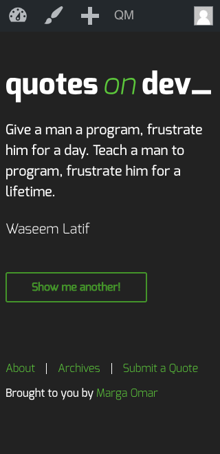
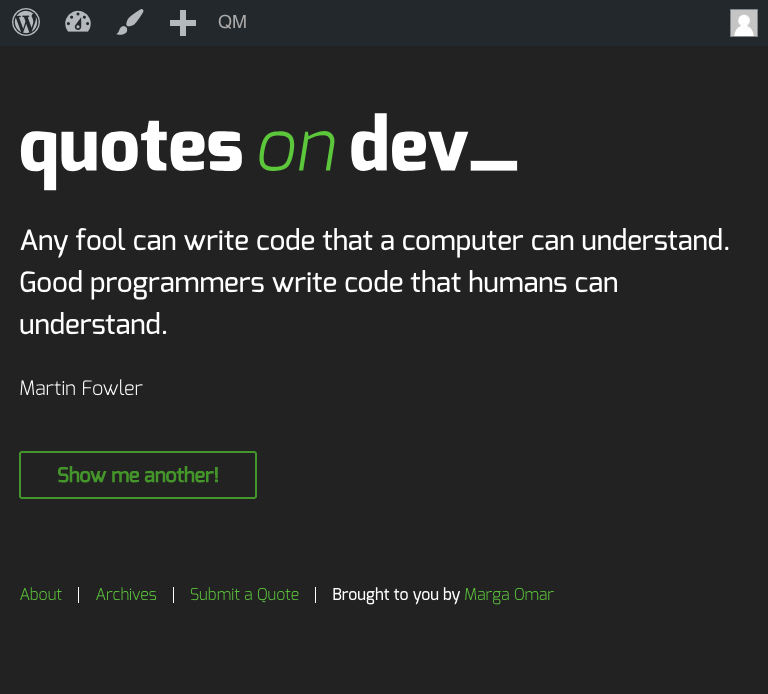
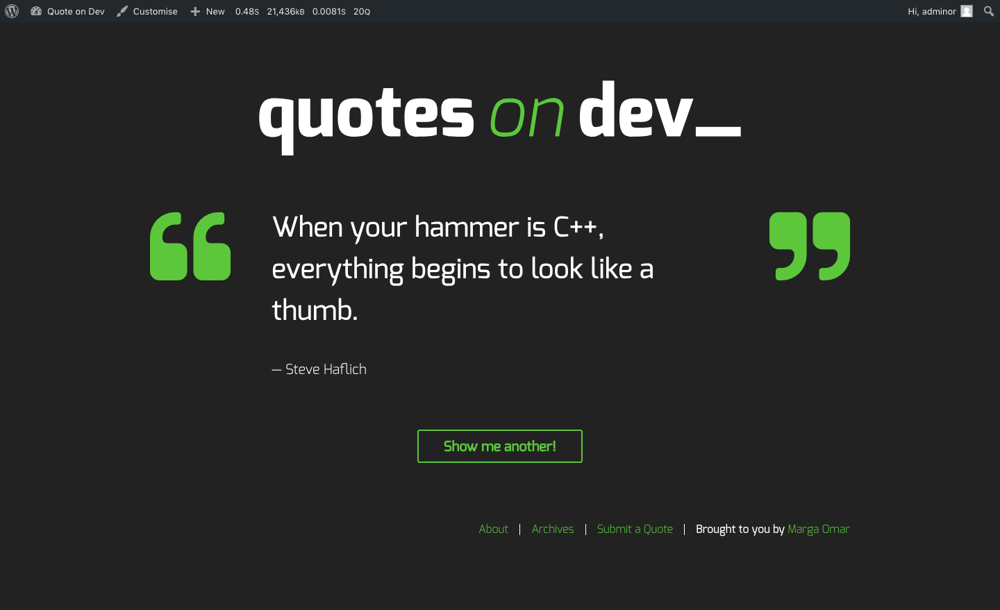
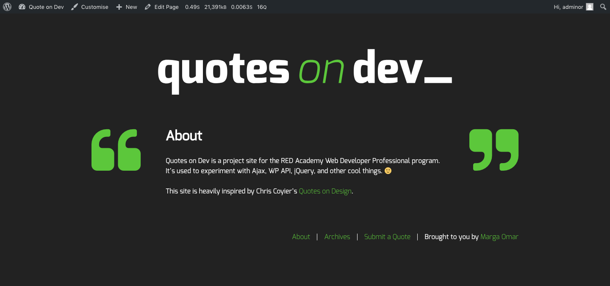
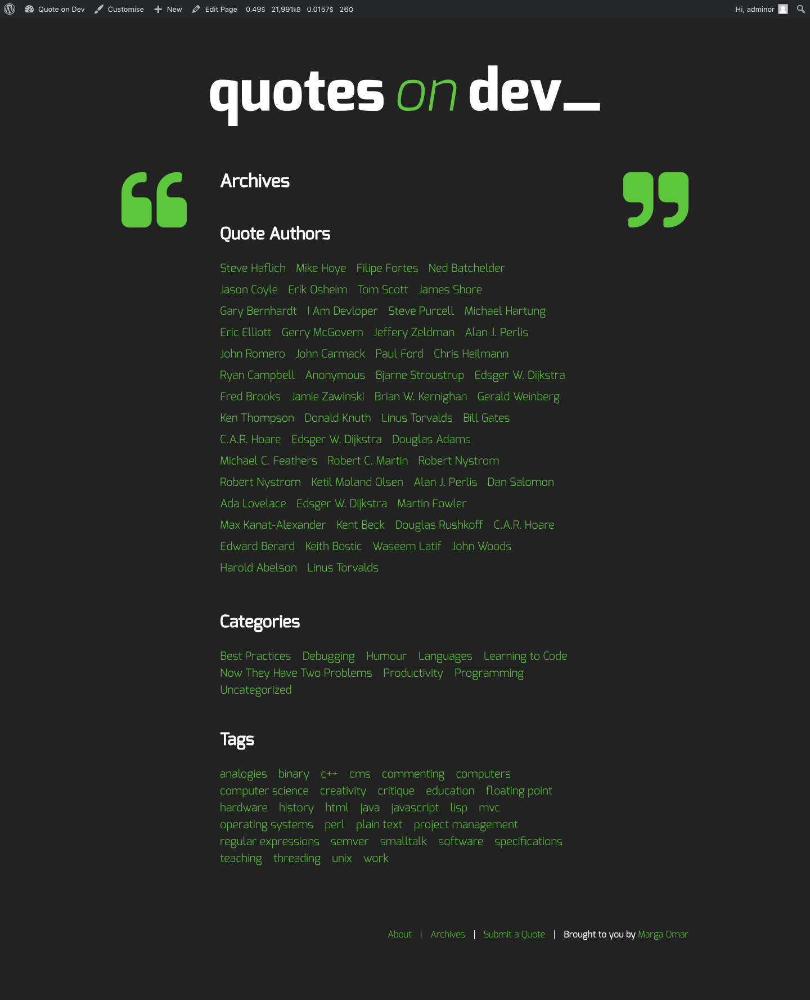
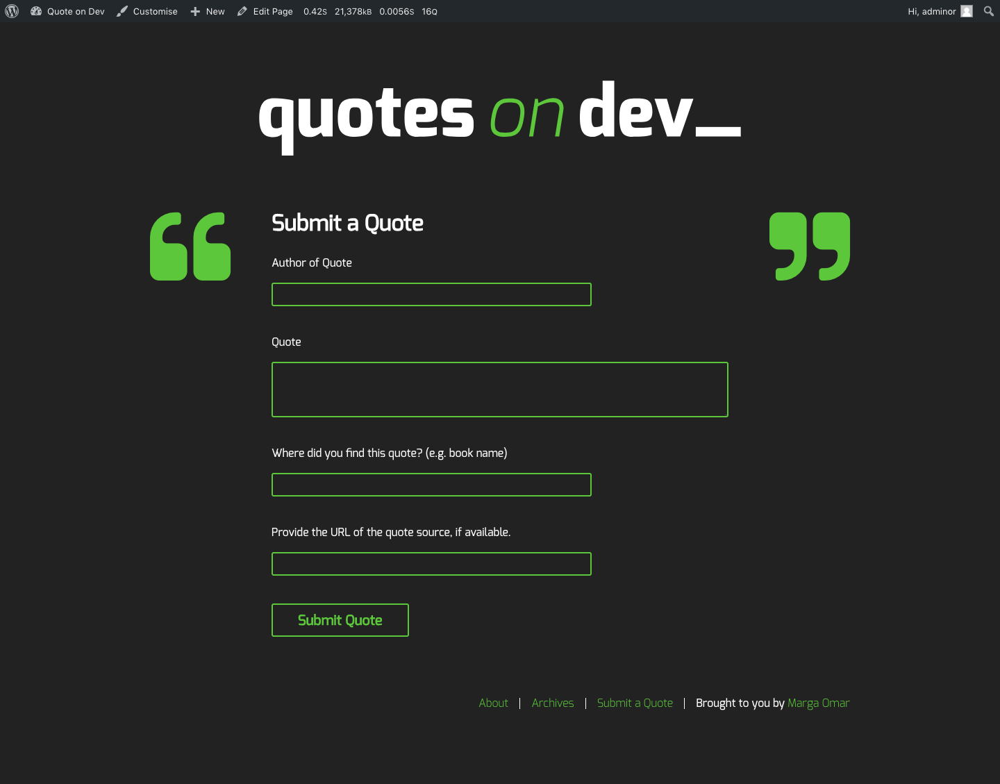

# Project: Quote on Dev | Wordpress Site.
## About this project
You can see this project on-line, going to [Quote on Dev | Wordpress Site](http://margaomar.com/qod/index.html)

----
## Goals of the site
This site has been created to learn how to use AJAX API in a customized wordpress theme, calling a "new quote" from our bbdd and alowing a user to upload a new quote by our form, if this user is logged, without conecting directly with our dashboard, and keeping the new post in a "pending" status. 

Wordpress Technology, WP REST API, PHP, MAMP, JQUERY, HTML5 and CSS3. 

> Hand-Crafter Styles
Quote on Dev Wordpress Site has five different sections: home, about, archive and submit a quote. Every archive has a different style and archive files. There you can search by author, categories or tags.

----
## Technology used
Wordpress | WP REST API | MAMP | PHP | JQuery | HTML5 | CSS3 | Gulp | Sass (CSS Preprocessors) | Git | Github | FontFace | 

----
## Personal Learnings

1. WP REST API
2. Wordpress technology 
3. MAMP
4. PHP 
5. JQuery
6. Fetch request from API with WP
7. Submit data from form with WP

----
## Link to the files on Github
* **[Quote on Dev Wordpress Site on Github](https://github.com/margaomar/qod)**

----
## Media Query Break Point (Mobile first project)

* 1200px
* 620px

----
## Device Screenshots
----

----

>Home page | Mobile
----

----
>Home page | Tablet
----

----
>Home page | Desktop
----

----
>About page
----

----
>Archives page
----

----
>Submit a quote page

----

----
## Installation instructions

Run these commands to start the project:  
* npm install
* gulp

----
## Dead Line for the project
* 27-Nov-2018

----
## Project developed by 
 **[Marga Omar](https://margaomar.com)**